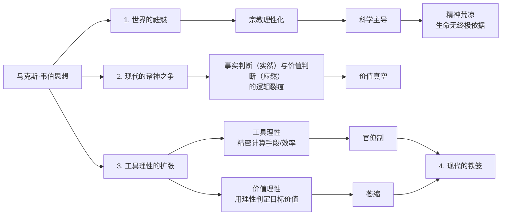
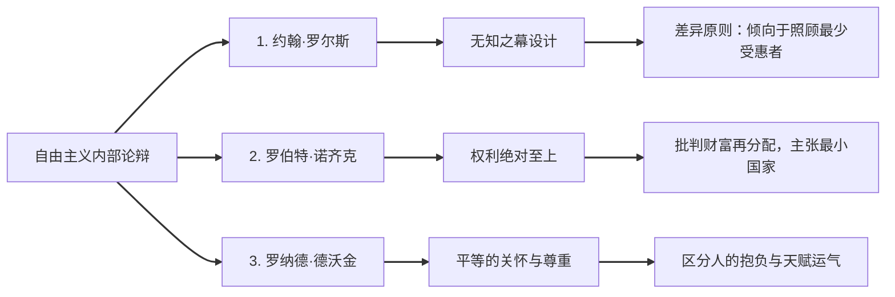

# 📚 《西方现代思想讲义》全景体系化读书笔记

> [!important]
> 人工智能披露：由 Gemini 生成

整个现代思想的知识体系以 **“现代性问题”** 为核心演进轴线，分为“宏观背景”、“个体精神危机”、“社会政治困境”、“现代秩序重建”以及“全球化尾声”五大核心模块。

## 🗺️ 模块一：现代性导论 —— 古今之变

### 1. 思想与现实的互构

- **核心观念**：**现实离不开思想**。人们在社会实践中所追求的“现实利益”绝非单纯的物质指标，而是由特定的思想观念框架所定义和驱动的。例如：名牌消费背后的文化意义、领土争端背后的主权观念、春运现象背后的孝道认同。
- **研究核心**：分析、诊断与反思什么样的思想观念塑造了现代社会的行动逻辑，构成了现代世界的复杂性。

### 2. 现代性（Modernity）的概念群

- **现代**：不仅是一个时间段，更是一种**崭新的线性矢量的历史观与时间意识**。它否定传统循环宿命，面向未来，肯定人类的创造性与主体性。
- **现代化**：指西方自文艺复兴以来，由“启蒙理性主义”推动的社会历史变革**过程**。
- **现代性**：指现代化变革在经济（工业化、城市化）、政治（民主、宪政）、社会（人口流动）和文化（理性主导、权利意识）上沉淀下来的**结果与特征**。

### 3. 古今之变的本质：从“自然”到“不自然”

古代人相信世界存在一个外在的、天生如此的“自然秩序”，万物皆有其内在目的（如亚历山大、亚里士多德的终极宇宙观）。现代人用理性打破了自然秩序的神话，造成了两大观念转折：

- **人类中心主义转向**：人类从宇宙母体中脱离，成为“主体”（Subject），将自然世界视为可观察、可征服的“客体”（Object）。这一转向带来了科技与工业的伟大成就，但也埋下了生态环境灾难的隐患。
- **个人主义转向**：个人从传统的、牢固的社群关系（血肉共同体）中脱离出来，成为具有高度自主性的独立个体。这一转向带来了空前的个人自由与多样性，但其代价是现代人普遍的孤独感、漂泊感和乡愁。

## 🏛️ 模块二：现代思想的成年 —— 马克斯·韦伯的诊断

德国社会学家马克斯·韦伯系统解释了现代世界的底层运作机制（看清现代），并指出了现代化本身的深层缺陷（反思现代），标志着现代思想的成年。

### 1. 世界的祛魅（Disenchantment）

- **内涵**：用理性的力量驱散了古代万物有灵、神怪冥冥的神秘魅惑，自然世界被客观化、因果规律化。
- **发展阶段**：第一阶段为“宗教的理性化”（驱逐巫术，用哲学理性论证宗教合理性）；第二阶段科学理性彻底挑战超验宗教，完成世俗化。
- **后果**：自然世界成为可以用冷冰冰的因果规律解释的物理世界。人类被从无尽时空的宇宙母体中剥离，**“一切终极而最崇高的价值，已自公共领域隐没”**。科学让人从迷信中清醒，但无法为生命的意义提供根本依据，给现代人留下了“清澈之中的荒凉”。

### 2. 现代的“诸神之争”

- **事实与价值的分裂**：
  - **事实判断**：属于“实然”领域（是什么），有客观标准（客观世界），科学理性在此领域是无敌的高手。
  - **价值判断**：属于“应然”领域（应当如何），在世界祛魅后失去了统一的自然或神圣标准，标准取决于个人，具有强烈主观性。
- **困境**：西方真、善、美一体的传统破裂（如恶之花）。科学与生命意义无关，它提供不了生命指南。社会陷入**价值多元化困境**与**价值真空**。在个人层面，选项缺乏确定依据导致长期内心的动摇与焦虑（“我喜欢”成为脆弱的孤证）；在公共社会层面，在关键议题（如堕胎、自由与安全）上陷入由于终极态度互不相容而无法化解的撕裂。

### 3. 工具理性的压倒性扩张

- **两种理性**：
  - **工具理性**：针对确定目标，通过精密**“计算”**成本与收益，找到最优化的**手段**。其标准客观公认，可在现代社会普遍化。
  - **价值理性**：通过理性思考来判定**目标本身**是否具有价值。主观多元，在现代社会难以普遍化。
- **结果**：现代化进程演变为**“片面的理性化”**，工具理性大行其道，压倒并淹没了价值理性，导致**“手段压倒目的”**。例如：为了诗和远方而追求“财务自由”，最终陷于财富计算中，变得只会赚钱，人无法在金钱这座桥梁上栖居。

### 4. 现代的铁笼（The Iron Cage）

- **由来**：工具理性的极度扩张塑造了无处不在的**官僚制（Bureaucracy）**组织形式。官僚制奉行**“非个人化（对事不对人）”**原则，为追求系统总效益与高效率，将复杂的个人简化为可计算的数据与绩效指标（KPI）。
- **铁笼的弊端**：
  1. 社会文化讲求利益计算，试图**“用功利得失解决道德问题”**，治标不治本。
  2. 社会关系沦为商业供求关系，人被“非人化”为社会机器上的优质零件，人的自我发展被替换为**“提升自己作为商品的价值”**以满足人才市场需求（“专家没有灵魂”）。
- **现代两难**：铁笼在囚禁、异化人的灵性的同时，又是现代高度发达的物质文明、公平绩效制以及现代生活的社会基础与保障。它既束缚我们，又庇护我们。

## 🧠 模块三：个体的精神危机 —— 传统信仰的坍塌与重构

在上帝死后、理性显露局限的时代背景下，现代人面临着心灵无家可归的精神与信仰危机。

### 1. 尼采：激进的反叛与创造

- **“上帝死了”的真实意涵**：这绝非一句轻松的欢呼，而是沉痛的宣告（“是我们杀死了上帝！”）。指控人类用自欺欺人的形而上学虚假教义篡改了耶稣关于“应该怎么生活”的启示，最终使信仰破产，让人类暴露于无尽的虚空与虚无主义中。
- **形而上学批判**：西方哲学形而上学的三大信念（本质世界、目的性、统一性）是人类心灵脆弱、无法直面现实痛苦时编造出来的幻觉安慰。它否定了生命的真实本能欲望，才是**虚无主义真正的根源**。
- **超人学说与积极的虚无主义**：
  - **奴隶道德**：放弃生命激情，用虚假教义约束自我、逃避拼搏，寻求虚妄的安慰。
  - **主人道德**：放弃一切幻觉，直面人生本无客观真理的真相（积极虚无主义）。像推巨石的**西西弗斯**那样，立足现实，以强大的生命本能和意志去进行主观的价值创造，**“成为你自己”**，成为自己生命的主人（超人）。
- **视角主义（Perspectivism）**：**“没有事实，只有阐释”**、**“视角决定事实”**。不存在由上帝看出来的客观真相，客观性只是一种人们在特定问题上产生共同视角所形成的“合理错觉”。这一洞见解释了当今**“后真相”时代**意见分裂的本质，其核心启示并非宣扬绝对分裂，而是警醒个人视角并非绝对，从而提示了“谦逊的必要”，邀请人们通过融合不同的视角来使概念更完整。

### 2. 弗洛伊德：理性人观念的死亡

- **无意识的发现**：弗洛伊德以心理医生的科学证据反叛了西方“人是理性动物”的传统，宣告了**“理性人的死亡”**。他将精神结构比作冰山，表层的意识和理性思考只是冰山一角，水面之下是巨大的、生猛有力却又隐秘的**“无意识”**领域（性欲本能和攻击本能），它像深层洋流般支配着人的行动。
- **人格结构三元说**：
  - **本我（Id）**：处于无意识的最底层，遵循“快乐原则”，是盲目追求原始本能欲望即刻满足的“小婴儿”。
  - **自我（Ego）**：能够意识到的自己，遵循“现实原则”，是具有理性的“监护人”或“骑手”，在社会规则下有选择地满足本我。
  - **超我（Superego）**：人格的最高层，是家庭和社会道德权威内在化形成的理想人格（天使），通过内疚感和罪恶感制约自我。

## ⚔️ 模块四：社会政治困境与晚期秩序重建

当工具理性推向极端，价值一元化与对绝对真理的狂热在20世纪演变为深重的社会灾难，迫使哲学家们对社会秩序展开反思与重建。

### 1. 20世纪的沉重教训

- **齐格蒙·鲍曼：现代性与大屠杀** —— 纳粹大屠杀不是野蛮对文明的倒退，恰恰是现代文明的产物。高度发达的现代官僚制、非个人化程序和工具理性计算，把大屠杀变成了一场高效率的工业化流水线作业，导致身处其中的零件（普通人）丧失了对最终残忍后果的道德感知。
- **汉娜·阿伦特：平庸之恶（The Banality of Evil）** —— 罪恶的制造者（如战犯艾希曼）并不一定是丧心病狂的恶魔，而可能是普通的官员。这种深重罪恶的根源在于**“丧失了独立思考的能力”**，盲目、顺从地执行体制的指令，放弃了个人的道德判断。
- **卡尔·波普尔：捍卫开放社会** —— 提出**“证伪主义”**，认为科学的本质在于“可被证明是错的（可证伪）”，以此批判历史决定论。他反对通往完美理想国的“乌托邦工程”（全盘设计社会秩序），主张以允许质疑、民主纠错的**“零星社会工程”**来保护**“开放社会”**。
- **弗里德里希·哈耶克：警惕自发秩序的颠覆** —— 提出社会的复杂知识是分散在每个人身上的“局部知识”，强力推行中央计划经济必然会因无法收集完整知识而导致失败。高度集中的计划必然侵蚀个人自由，最终沦为**“走向奴役之路”**。市场、法律与语言都是自发演化出来的“自发秩序”，而非人为打包设计的产物。
- **以赛亚·伯林：两种自由的红线** —— 区分**消极自由**（“免于……的干涉”，为个人保留一块私密空间）与**积极自由**（“去做……以实现自我”）。伯林警告，**积极自由极易被极权主义滥用**。当某些集团宣称掌握了唯一正确的、崇高的集体目标（价值一元论），并以此“强迫你走向正确”时，个人的消极自由就会被彻底剥夺。多元价值是互不相容且不可通约的，必须守住消极自由的底线。
- **赫伯特·马尔库塞：物质贿赂下的“单面人”** —— 发达工业社会通过提供空前丰富的物质消费、娱乐媒体和舒适生活，成功地消解了无产阶级的反叛性（“贿赂”了大众）。人们误以为自己是自由的，但实际上已经丧失了批判和反思能力，彻底沦为顺从生产与消费逻辑的“单面人”。

### 2. 晚期现代自由主义的内部重建与论辩

针对20世纪后半叶在自由、平等与多元诉求下的社会秩序难题，主流自由主义哲学内部展开了激烈交锋。

- **约翰·罗尔斯：《正义论》与福利国家** —— 提出**“无知之幕（Veil of Ignorance）”**的思想实验，在剥离所有人现实身份（阶级、天赋、性别）的帷幕后，推导出正义两原则：第一原则保障每个人平等的、最广泛的基本自由；第二原则（差异原则）指出，社会和经济的不平等安排必须**符合最少受惠者的最大利益**。该理论为现代西方财富再分配和“福利国家”制度奠定了哲学正当性。
- **罗伯特·诺齐克：自由至上主义的反击** —— 针锋相对地反对罗尔斯的再分配正义。诺齐克认为**个人权利绝对神圣**。只要资产的原始取得和交易转让是正义的，最终形成的财富差距就是合法的。政府任何强迫性的税收福利政策在本质上都是对个人劳动成果的掠夺。他倡导国家只需扮演保护产权、维持治安的**“最小国家（守夜人）”**角色。
- **罗纳德·德沃金：平等的关怀与尊重** —— 认为自由与平等内在统一，自由主义的核心在于“平等的关怀与尊重”。社会资源分配应当区分个人的“抱负”与“天赋（或运气）”。社会应当为个人由于残疾、先天劣势（天赋运气差）等无能为力的因素买单，但不应当为个人因为自身的奢侈选择或懒惰（抱负）所带来的后果负责。

### 3. 社群主义对自由主义的联合批判

*以桑德尔（Michael Sandel）、沃尔泽（Michael Walzer）、泰勒（Charles Taylor）为代表的社群主义阵营，对自由主义的“原子化个人”假设发起猛烈批判。*

- **迈克尔·桑德尔**：不存在罗尔斯笔下那种“无约束的自我”。个人的身份、道德感和责任感是由他所处的**社群（家庭、历史、国家、文化共同体）**所内生赋予的，公共生活必须重申共同体良善与公共美德的力量。
- **查尔斯·泰勒**：个人的认同是在现代社会的**“对话关系”**中塑造的。极端的个人主义会让人陷入孤立和无意义的浅薄中。我们必须重拾社群与历史所赋予的、超越个人主观意愿的外部“意义框架”，并在对话中寻找价值纽带。

### 4. 尤根·哈贝马斯：交往理性与共识的重塑

- **交往理性（Communicative Rationality）** —— 哈贝马斯试图挽救被工具理性蚕食的现代精神世界。面对韦伯“诸神之争”的绝望困境，哈贝马斯提出，除了工具理性，人类还拥有一种通过语言进行理解、沟通的“交往理性”。只要社会能够构建一个消除强迫、平等、求真的**“理想言说情境”**，人类完全有可能在价值领域达成富有成果的**公共共识（互为主体性）**。现代性并不是失败的陷阱，而是一个**“未竟的事業（尚未完成的宏大事业）”**。

## 🌍 模块五：尾声 —— 全球化时代的宏大预言

冷战结束后，人类秩序的焦点从西方内部的制度辩论走向了全球化浪潮下的跨文明博弈。

### 1. 弗朗西斯·福山：历史的终结（The End of History）

- **核心观点**：冷战的结束标志着意识形态斗争的终结，**自由民主制与自由市场资本主义**是人类政治制度的终极形态，在观念的层面上，人类已经找不到更优的替代方案。
- **底层动力**：推动历史走向该终点的根本动力，除了经济科技的发展，更源于人类天性中渴望**“获得平等承认（承认自身尊严）”**的普遍心理需求。

### 2. 塞缪尔·亨廷顿：文明的冲突（The Clash of Civilizations）

- **核心观点**：针锋相对地反驳福山的普世化幻想。亨廷顿指出，冷战后世界冲突的根源不再是政治意识形态或经济利益，而是**不同文明之间的文化裂痕**。
- **全球格局**：全球政治将围绕西方文明、中华文明、伊斯兰文明等七到八个主要文明的断层线展开。全球化没有消除差异，反而让文化、宗教这些根深蒂固的传统身份认同问题变得更加敏感、排他与尖锐，世界正在走向“西方与非西方的对抗”。

## 💡 总结：现代人的思想历险与自觉

通读整本《西方现代思想讲义》，我们完成了一次宏大的观念探险：

1. **看清世界的境况**：从韦伯的“祛魅”与“铁笼”开始，我们意识到了现代人在享受巨大物质文明与个人自由的同时，必须吞下“精神荒凉、工具理性异化、手段吞噬目的”的苦果。
2. **直面个体的危机**：尼采、弗洛伊德和萨特倒逼我们告别自欺欺人的形而上学和纯粹的理性神话，让我们学会在没有上帝、充满无意识的世界里，以积极的虚无主义去勇敢地“自我创造”和“确立意义”。
3. **反思社会的教训**：20世纪的极权灾难警醒我们，必须对片面的效率、强加的政治正确以及全盘设计的乌托邦保持高度的警惕，在保障自由的前提下，艰苦地寻求平等与社群共识。

正如刘擎教授在序言中所说，理解现代思想的来龙去脉，不是为了获得一个死板的现成答案，而是为了让我们学着做一个**“清醒的现代人”**——明白自己是谁、在做什么，并在认清生活的真相之后，依然保有饱满的生命力与坚强。

